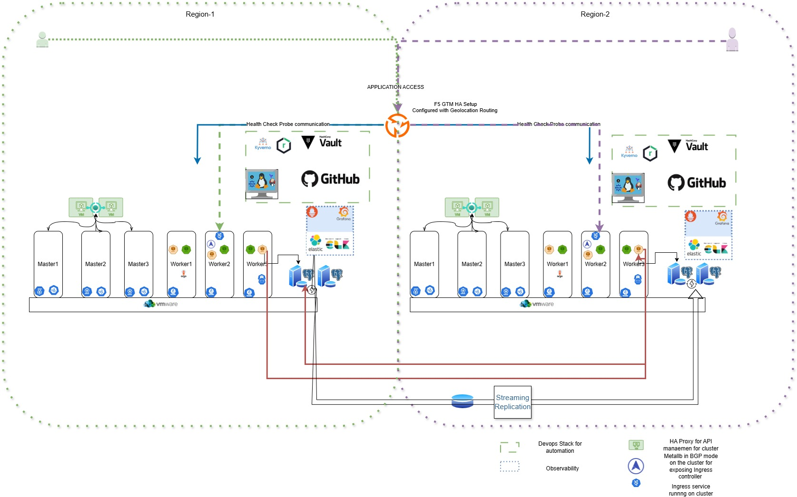

# DevOps Technical Challenge

## Scenario

You are tasked with implementing a platform to support a microservices architecture composed of a backend service, frontend service, and PostgreSQL database with the following requirements:
 - Automated Deployment
 - Fault Tolerant / Highly Available
 - Secure
 - Autoscaling

## Infrastructure Platforms 
### Approach-1   On-Premises Environment 
## Visual Architecture

Refer to `architectural-diagram.jpg`:



* Two clusters (left/right) with HA between them
* HAProxy + Keepalived for virtual IP and probe-based failover
* GitOps-based deployments through ArgoCD
* External Observability stack 
* Streaming replication for state sync (e.g., PostgreSQL)


---

## Assumptions for Approach 1

1. **Greenfield Deployment**: This setup assumes a brand-new environment with no pre-existing infrastructure, Kubernetes installations, or CI/CD pipelines. All configurations, networking, DNS, and VM templates are provisioned from scratch as part of this deployment.

2. **On-Premises Focus**: The infrastructure is built primarily on VMware vSphere, indicating an on-premise data center environment with enterprise-grade virtualization features.

3. **Network Reachability**: Regions A and B are connected via VPN, direct fiber, or routed WAN to support Active-Active synchronization and observability.

4. **Platform Team Access**: Platform engineering has full access to DNS, firewall, load balancer, and IPAM configurations to support service discovery, MetalLB, and ingress routing.

5. **Secrets Management**: Vault is already set up and accessible for secure handling of sensitive data.

6. **Git Integration**: Platform team has access to Github for setting up repositories for Terraform, Ansible, and Helm charts 
7. **Automation Service Account**: A RBAC is already in place with required access to every system. 
8. Database Failover or Active/Active Setup is already in Place

---

## 1. **Infrastructure Platform**

#### Chosen Platform: **VMware vSphere**

* **Reason**: Enterprise-grade virtualization that supports high availability, snapshots, backup integrations, antiaffinity rules, DRS and robust networking features.
* **Deployment Environment**:

  * Two separate clusters (e.g., Region A and Region B)
  * Each region hosts:

    * 3 Control plane nodes (masters)
    * 3 Worker nodes
    * Deployed on dedicated ESXi hosts     * 
* **High Availability**:

  * Anti-affinity rules prevent co-scheduling of critical nodes on the same host.
  * HAProxy + Keepalived provides a virtual IP for API access.

#### Database Setup 
We will discuss two environment approaches for databases below:
- Non critical or Non production environment => we will use statefulset
- Production or Critical environment => we should use a HA based DB deployment replication. 

**Why did I choose VM over stateful set in production**
- To reduce the single point of failure on the cluster. If something happens to cluster we can easily deploy stateless applications on another clusters make them available in shorter time. 
- In Active-Active Setup DB replication places a vital role and Handling it over PVC(storage) replication is quite challenging and not recommended.
- By Design DB systems are complex in design, which needs high accuracy with Storage IOPS,  So VMs offer more better IOPS I/O Performance along with custom os level tuning , Network Stability and DB certified HA Capabilities 

---
### 2. **Orchestration Technology and Components**

### Chosen: **Kubernetes (K8s)**

#### Key Components:
* **Source Code Management:** Github
* **Control Plane**: 3 vms running control plane components like kube-apiserver, controller-manager, scheduler, etcd on each region 
* **Nodes**: Minimum 3 vms running worker servives like kubelet, kube-proxy, containerd runtime
* **CNI Plugin**: Calico for network policies and IP management
* **Ingress**: NGINX Ingress Controller exposed via MetalLB (BGP mode)
* **Storage**: CSI-enabled storage like Longhorn or Ceph via Rook. 
* **Kubernetes Hardening**: Ansible for Node level hardening and Kyverno for cluster level hardening 
* **GitOps Engine**: ArgoCD
* **Security & Policy Enforcement**: Kyverno
* **Monitoring**: Internal Prometheus shipping logs to External Prometheus + Grafana
* **Logging**: External EFK (Elasticsearch, Fluent-bit, Kibana)
* **HA Management for API**: HAProxy + Keepalived
---
Let me divide the whole setup in day0, day1 and day2. 

## Day0 and Day1 Operations 

### 3. **Infrastructure Automation with Terraform**

#### Summary:

* Uses `vsphere_virtual_machine` to provision control plane and worker nodes.
* Inputs fetched dynamically from environment-specific JSON files.
* Anti-affinity rules enforced using `vsphere_compute_cluster_vm_anti_affinity_rule`.
* Remote state stored securely in AWS S3 with locking via DynamoDB.

[Key Code Snippet](on-premises/platform-engine/README.md#Terraform-sample-snippet)

Key Considerations:

* Secrets stored in Vault and fetched at runtime kept as environmental variables so that they dont get stored in state file 
* Backend state encryption enabled in S3
* PR validation includes `terraform fmt` and `terraform validate`
* Jenkins pipeline stages for validation and apply
---

### 4. **Cluster and Microservices Automation**

#### Tool: **Ansible**

##### Roles:

* `common`: Disables swap, installs base packages, sets up containerd, kubelet, kubeadm, kubectl
* `k8s-engine`: Initializes control plane on master1, joins others
* `post-cluster-provisioning`: HAProxy, Keepalived, Ingress, MetalLB, ArgoCD, Kyverno, CSI

[Detailed code Snippet](on-premises/platform-engine/README.md#Ansible)

### ArgoCD deployment for GitOps:

* ArgoCD is deployed as an Ansible-managed resource
* Applications (e.g., Kyverno) defined as ArgoCD Application CRs and policies from Centralize Kyverno policy helm chart
* Helm-based values used for templating from Centralize Kyverno policy templates
* Day1 key solutions like Observability stack and Compliance stack will be deployed as a application making the cluster always compliant. 
  
[Detailed code Snippet](on-premises/platform-engine/README.md#Ansible-tasks-for-cluster-prereqs)

---

#### 5. **Release Lifecycle Strategy**
##### Triggers: 
**Option-1**: I preferred manual pipeline execution for day0 operations because these changes are big and sometimes disruptive in nature.

**Option-2**: Github webhook whenever files are committed to jenkins github webhook. Pipeline to trigger on githubPush event and changeset  is 3 files(workers.json,master.json and haproxy.json) under terraform/environment directory 

**Detailed steps inside Jenkins Pipeline**

```
Vault auth with Jenkins Credentials 
↓
Infrastructure provisioning Terraform (Validate, plan and then apply)
↓
Ansible Inventory Generation 
↓
Cluster setup using Ansible roles(common and K8S engine)
↓
Day1 Operations-1(Cluster Hardening of Control plane files and Kyverno)
↓
Day 1 Operations-2 (ArgoCD Vault Integration, Ingress creation and Argocd Setup)
↓
Day 1 Operations-3 (Cluster Hardening with Kyverno center policy helm chart, Observability Setup and Parent app creation for Actual workload Applications )
```
Detailed code snippets for [Day0](on-premises/platform-engine/README.md#Day0) and [Day1](on-premises/platform-engine/README.md#Day1) 

---
